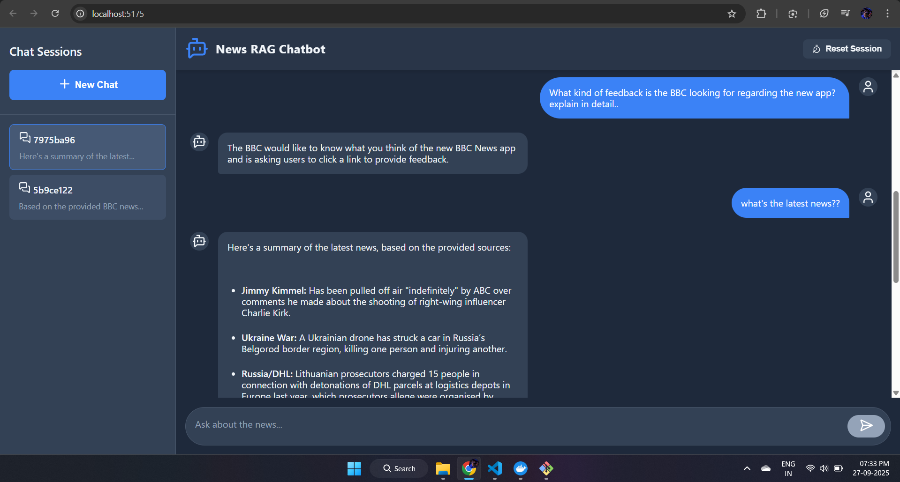

RAG-Powered Chatbot Backend

Node.js (Express) backend implementing a Retrieval-Augmented Generation (RAG) chatbot over news articles.

Tech Stack

- Express (API)
- Redis (session + chat history cache)
- ChromaDB (vector database)
- Jina AI Embeddings API (embeddings; 10M free tokens)
- Google Gemini (LLM via Google AI Studio)

## Screenshot

Environment Variables
Create a .env file in backend/ with the following keys. Placeholders are safe; you can paste your own keys later.

PORT=3000

# Redis

REDIS_URL=redis://localhost:6379
SESSION_TTL_SECONDS=86400

# Chroma server

CHROMA_URL=http://localhost:8000
CHROMA_COLLECTION=news_articles

# Jina AI Embeddings API

JINA_API_KEY=your_jina_api_key_here

# Google Gemini

GEMINI_API_KEY=your_gemini_api_key_here
GEMINI_MODEL=gemini-1.5-flash

Prerequisites

- Node.js 18+
- Docker (recommended) or local installs for Redis and ChromaDB

Start dependencies (recommended via Docker):

Redis:
docker run -p 6379:6379 --name rag-redis -d redis:7

ChromaDB server (latest image):
docker run -p 8000:8000 --name rag-chroma -d chromadb/chroma:latest

Alternatively, install locally:

- Redis: redis-server on port 6379
- Chroma: pip install chromadb then chroma run --host 0.0.0.0 --port 8000

Install & Run (Backend)
cd backend
npm install
npm run dev

# server at http://localhost:3000

Ingest News Articles (~50)
This script fetches headlines via RSS, scrapes article text, embeds with Jina AI, and upserts to Chroma.

# Ensure .env has JINA_API_KEY and Chroma/Redis are running

npm run ingest

Notes:

- Default RSS feeds: NYTimes, BBC, Al Jazeera (adjust in scripts/ingest.js).
- The scraper uses a simple 
 aggregation; for production, add site-specific selectors and cleaning.

API Endpoints

- GET /health → health check
- POST /api/chat/message → body: { sessionId?, message }
  - Creates or uses sessionId, retrieves top-k from Chroma, calls Gemini with context, returns { sessionId, answer, contexts }.
- GET /api/chat/history/:sessionId → returns { sessionId, history }
- POST /api/session/reset → body: { sessionId } clears chat history
- GET /api/session/history/:sessionId → same as chat history

Session & Caching Strategy

- Chat history stored in Redis key session:<id>:history with TTL SESSION_TTL_SECONDS (default 24h).
- On every message, both user and assistant messages are appended; Redis TTL is refreshed on write.
- Invalidation: POST /api/session/reset deletes the key immediately. Natural expiration via TTL handles idle sessions.
- Cache warming (optional): preload popular questions by calling /api/chat/message with curated prompts after ingestion, or precompute embeddings for frequent queries and store in Redis.

Local Frontend
The frontend dev server proxies /api to http://localhost:3000.
cd frontend
npm install
npm run dev

# open http://localhost:5173

Notes

- Ensure .env contains valid HF_API_KEY and GEMINI_API_KEY.
- Chroma collection name defaults to news_articles; change via CHROMA_COLLECTION.
- To reindex, rerun npm run ingest. Upserts will overwrite existing ids.

## Troubleshooting

### Embeddings API Issues

- Now using Jina AI Embeddings API which is much more reliable than Hugging Face.
- Jina provides 10M free tokens, no credit card required.
- If you get errors, check your JINA_API_KEY in the .env file.

### Docker Issues

- If containers fail to start, check logs: docker logs rag-redis or docker logs rag-chroma
- Remove and recreate containers if needed: docker rm -f rag-redis rag-chroma then run the docker commands again
- Ensure Docker Desktop is running and has sufficient resources allocated
